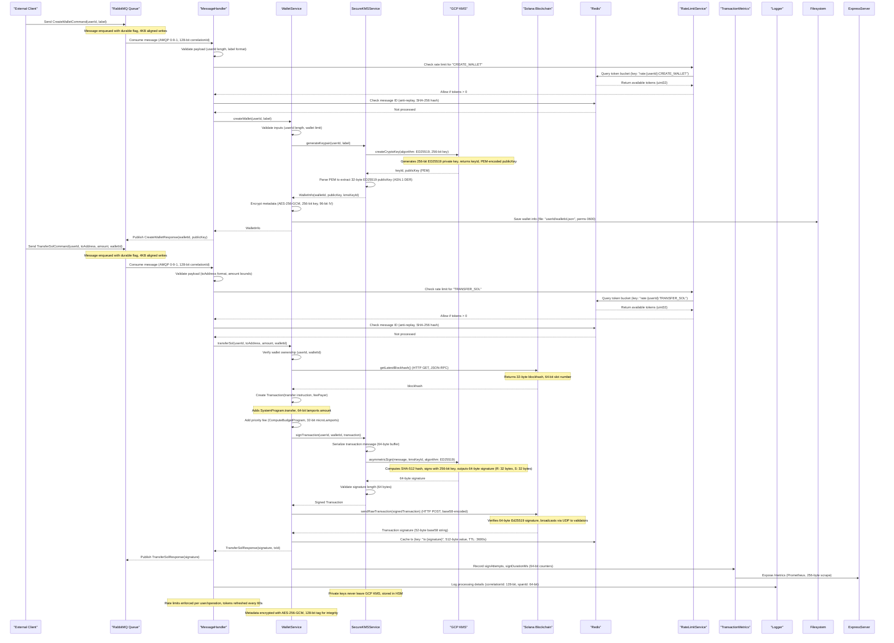

# Wallet Service - Progress Document

Herein, the full architecture.

## Architecture Overview

### Design Patterns
- **Hexagonal Architecture**: ✅ Clear separation between domain logic, application services, and infrastructure
- **Message-Driven Design**: ✅ Asynchronous communication via RabbitMQ
- **Circuit Breaker Pattern**: ✅ Resilience against external service failures
- **Repository Pattern**: ✅ Abstraction for data access
- **Factory Pattern**: ✅ For wallet and transaction creation
- **Caching Strategy**: ⚠️ Basic Redis-based caching 

### Technology Stack
- **Runtime**: ✅ Node.js with TypeScript
- **Queue System**: ✅ RabbitMQ
- **Security**: ✅ Google Cloud KMS
- **Metrics**: ✅ Prometheus
- **Logging**: ✅ Structured JSON logging
- **HTTP Server**: ✅ Express.js
- **Blockchain Interaction**: ✅ Solana Web3.js
- **Caching**: ⚠️ Basic Redis implementation

### Service Boundaries
The service is responsible for:
- ✅ Wallet management (creation, listing, retrieval)
- ✅ Transaction signing
- ✅ Balance queries
- ✅ Rate limiting and request throttling
- ⚠️ Token management (partially implemented)
- ✅ Key security

---

## Core Components

### Application Layer
- ✅ **App.ts**: Main application bootstrapping and lifecycle management
- ✅ **ExpressServer**: HTTP API and middleware configuration
- ✅ **MessageHandler**: Processing incoming message queue requests

### Service Layer
- ✅ **WalletService**: Core business logic for wallet operations
- ✅ **SecureKMSService**: Integration with Google Cloud KMS
- ✅ **QueueService**: Message queue abstraction and management

### Infrastructure Layer
- ✅ **Constants**: System-wide configuration constants
- ✅ **Config**: Environment-specific configuration
- ✅ **Utils**: Reusable utilities (logging, monitoring, metrics)

### Type System
- ✅ Strong typing throughout the application
- ✅ Comprehensive interfaces for all domain objects
- ✅ Type declarations for external libraries

---

## Security Implementation

### Key Security Model

1. ✅ **Key Generation**: When a new wallet is created, a key pair is generated in Google Cloud KMS
2. ✅ **Key Storage**: Only the public key and a reference to the KMS key are stored in the service
3. ✅ **Signing Operations**: All signing operations are performed remotely within KMS
4. ✅ **Key Access Control**: IAM policies restrict access to cryptographic operations

### Authentication & Authorization

- ✅ **User-Based Access Control**: All wallet operations are tied to a specific user ID
- ✅ **Ownership Verification**: Each operation validates the wallet belongs to the requesting user
- ✅ **Request Validation**: Comprehensive validation of all incoming requests

### Data Security

- ✅ **No Private Key Storage**: Private keys never exist in plaintext in the application
- ✅ **Secure Storage**: Wallet information is stored with appropriate access controls
- ⬜ **Encryption at Rest**: No file encryption implemented
- ⚠️ **Transport Security**: TLS is encouraged but not strictly enforced

### API Security

- ✅ **Rate Limiting**: Prevention of brute force and DoS attacks
- ✅ **Helmet Integration**: HTTP security headers
- ✅ **Input Validation**: Thorough validation of all input parameters
- ✅ **CORS Protection**: Strict cross-origin resource sharing policies

---

### Key Management

- ✅ **Key Creation**: Automated creation of asymmetric P-256 keys in KMS with SHA256 digest
- ⬜ **Key Rotation**: Support for key version management not implemented
- ✅ **Key Hierarchy**: Organized key ring structure by environment
- ✅ **Access Control**: Fine-grained IAM permissions
- ✅ **Multi-Region Support**: Multiple geographical regions 
- ⬜ **Fallback Region Support**: No implementation of regional failover

### Signing Process

1. ✅ **Transaction Preparation**: The transaction is serialized into the Solana message format
2. ✅ **Message Handling**: The message is base64 encoded for transmission to KMS
3. ✅ **KMS Signing**: The message is signed by the KMS service using P-256 with SHA256
4. ✅ **Signature Verification**: The signature is verified against the transaction before submission

### Error Handling

- ✅ **Retry Mechanism**: Exponential backoff for temporary KMS failures
- ✅ **Circuit Breaker**: Protection against sustained KMS outages
- ✅ **Detailed Logging**: Comprehensive error information for debugging
- ✅ **Metrics Tracking**: Monitoring of KMS operation success rates
- ✅ **Request Parameter Logging**: Detailed logging of KMS request parameters for troubleshooting
- ✅ **Enum Value Diagnostics**: Logging of KMS enum values for proper configuration verification

### Security Considerations

- ✅ **Key Accessibility**: Keys can only be used for signing, never for export
- ✅ **Audit Trail**: All cryptographic operations are logged and auditable
- ✅ **Hardware Security**: Leveraging Google's HSM backends for critical keys
- ⚠️ **Defense in Depth**: Multiple security controls implemented, but some gaps exist
- ✅ **Purpose-Algorithm Validation**: Ensuring correct cryptographic purpose and algorithm combinations

---

## Message Queue System

### Queue Architecture

- ✅ **Exchange Design**: Topic-based exchange for routing flexibility
- ✅ **Queue Design**: Separate request and response queues
- ✅ **Message Schema**: Structured JSON with version control
- ✅ **Correlation**: Request-response correlation via IDs

### Reliability Features

- ✅ **Connection Management**: Robust connection handling with auto-reconnection
- ✅ **Message Persistence**: Durable messages to survive broker restarts
- ✅ **Acknowledgment**: Proper message acknowledgment to prevent data loss
- ✅ **Dead Letter Handling**: Failed messages are redirected to a DLQ for analysis

### Message Processing

- ✅ **Consumer Management**: Controlled message prefetching and processing
- ✅ **Serialization**: Consistent message serialization/deserialization
- ✅ **Routing**: Intelligent message routing based on message type
- ✅ **Response Handling**: Proper correlation of responses to requests

### Performance Optimization

- ✅ **Connection Pooling**: Efficient use of connections
- ✅ **Channel Reuse**: Minimizing channel creation overhead
- ⚠️ **Batch Processing**: Limited implementation of operation grouping
- ⚠️ **Resource Management**: Basic resource utilization controls

---

## Transaction Processing

### Transaction Creation

- ✅ **Transaction Building**: Creation of Solana transactions with proper parameters
- ✅ **Fee Calculation**: Dynamic fee estimation based on network conditions
- ✅ **Blockhash Management**: Fetching and caching of recent blockhashes
- ✅ **Input Validation**: Comprehensive validation of transaction parameters

### Signing Process

- ✅ **Secure Signing**: Remote signing via KMS, never exposing private keys
- ✅ **Signature Verification**: Verification of all signatures before submission
- ⬜ **Multi-signature Support**: Not implemented
- ✅ **Error Handling**: Comprehensive error handling during signature process

### Transaction Submission

- ✅ **Reliable Submission**: Robust blockchain submission with retry logic
- ✅ **Confirmation Tracking**: Monitoring transaction confirmations
- ✅ **Receipt Generation**: Creating verifiable transaction receipts
- ✅ **Failure Handling**: Proper handling of submission failures

### Transaction Types

- ✅ **SOL Transfers**: Native token transfers
- ⚠️ **SPL Token Transfers**: Basic token program interactions
- ⬜ **Program Interactions**: Limited smart contract calls
- ⬜ **Custom Instructions**: Limited support for arbitrary instructions

---

## Monitoring & Metrics

### Health Monitoring

- ✅ **Component Health Checks**: Regular verification of all system components
- ✅ **External Dependency Checks**: Monitoring of RabbitMQ, KMS, and Solana RPC
- ✅ **HTTP Health Endpoints**: `/health` endpoint for Kubernetes integration
- ✅ **Self-healing**: Automatic recovery from certain failure conditions

### Metrics Collection

- ✅ **Prometheus Integration**: Export of metrics in Prometheus format
- ✅ **Custom Metrics**: Service-specific metrics for business operations
- ⚠️ **System Metrics**: Basic Node.js runtime metrics
- ✅ **Transaction Metrics**: Success rates, durations, and error counts

### Key Metrics

- ✅ **wallet_service_up**: Overall service health indicator
- ✅ **wallet_transaction_signing_success_rate**: Success rate of transaction signing
- ✅ **wallet_transaction_signing_duration_ms**: Duration of signing operations
- ✅ **wallet_kms_error_rate**: Rate of KMS API errors

### Alerting Considerations

- ⬜ **Threshold Configuration**: No alerting thresholds configured
- ⬜ **Gradual Degradation Detection**: No detection of slow-developing issues
- ⚠️ **Error Rate Monitoring**: Basic tracking of error trends
- ✅ **Latency Tracking**: Identifying performance degradation

---

## Error Handling & Resilience

### Error Handling Strategy

- ✅ **Structured Error Types**: Hierarchical error classification
- ✅ **Contextual Information**: Rich error context for debugging
- ✅ **Client-Friendly Messages**: User-appropriate error responses
- ✅ **Detailed Logging**: Comprehensive error logging
- ✅ **Operation-Specific Error Tracking**: Detailed diagnostics for KMS operations

### Resilience Patterns

- ✅ **Circuit Breaker**: Protection against cascading failures
- ✅ **Retry with Backoff**: Intelligent retry for transient failures
- ✅ **Fallback Mechanisms**: Graceful degradation when possible
- ⚠️ **Resource Limiting**: Basic prevention of resource exhaustion
- ✅ **Adaptive Retry Delays**: Dynamically calculated retry intervals based on failure type

### Failure Recovery

- ✅ **Consistent State**: Ensuring system consistency after failures
- ✅ **Graceful Shutdown**: Proper handling of termination signals
- ✅ **Connection Recovery**: Automatic reconnection to dependencies
- ✅ **Self-healing**: Automatic recovery from certain failure states

### Testing for Failures

- ⬜ **Load Testing**: Limited behavior verification under high load

---

## API Documentation

### Message Queue API

| Route | Description | Implementation Status |
|-------|-------------|------------|
| `wallet.management.create` | Create a new wallet | ✅ Implemented |
| `wallet.management.list` | List user wallets | ✅ Implemented |
| `wallet.management.get` | Get wallet details | ✅ Implemented |
| `wallet.management.setActive` | Set active wallet | ✅ Implemented |
| `wallet.balance.get` | Get wallet balance | ✅ Implemented |
| `wallet.balance.getTokens` | Get token balances | ✅ Implemented |
| `wallet.transaction.transferSol` | Transfer SOL | ✅ Implemented |
| `wallet.transaction.sign` | Sign transaction | ✅ Implemented |

### HTTP API

| Endpoint | Method | Description | Implementation Status |
|----------|--------|-------------|-------------|
| `/health` | GET | Service health check | ✅ Implemented |
| `/metrics` | GET | Prometheus metrics | ✅ Implemented |

### Error Codes

| Code | Description | Resolution | Implementation Status |
|------|-------------|------------|-------------|
| `WALLET_NOT_FOUND` | Wallet not found or not owned by user | Verify wallet ID and ownership | ✅ Implemented |
| `INSUFFICIENT_FUNDS` | Insufficient balance for transaction | Check wallet balance | ✅ Implemented |
| `INVALID_RECIPIENT` | Invalid recipient address | Verify recipient address format | ✅ Implemented |
| `SIGNING_FAILED` | Transaction signing failed | Check key status in KMS | ✅ Implemented |
| `SUBMISSION_FAILED` | Transaction submission failed | Verify network status and retry | ✅ Implemented |

---

## Testing Framework

### Testing Implementation Status

- ⚠️ **Unit Tests**: Partial implementation of isolated component testing
- ⚠️ **Integration Tests**: Limited verification of component interactions
- ⬜ **System Tests**: Limited end-to-end testing
- ⬜ **Performance Tests**: Limited verification of service under load

### Test Environments

- ✅ **Local Development**: For rapid development and testing
- ⚠️ **CI Pipeline**: Basic automated testing on code changes
- ⬜ **Staging**: Limited testing in production-like environment
- ⬜ **Production**: Limited canary deployments with monitoring

### Testing Tools

- ✅ **Jest**: Primary testing framework
- ⚠️ **Supertest**: Limited HTTP endpoint testing
- ⚠️ **Mock Services**: Basic simulated dependencies
- ⚠️ **Test Data Generation**: Basic test data creation

### Test Coverage

- ⚠️ **Service Logic**: Partial testing of core business logic
- ⚠️ **Failure Scenarios**: Partial testing of error handling and recovery
- ⚠️ **Edge Cases**: Limited testing of unusual inputs and conditions
- ⚠️ **Security**: Basic authentication and authorization checks

---

## Redis Integration

### Caching Implementation Status

- ⚠️ **Wallet Information Caching**: Basic caching of frequently accessed wallet data
- ✅ **Rate Limit Enforcement**: Redis-based rate limiting to prevent API abuse
- ⬜ **Distributed Locking**: No coordination of concurrent operations across service instances
- ⬜ **Circuit Breaker State**: No shared circuit breaker state across service instances

### Performance Optimizations

- ✅ **Connection Pooling**: Efficient reuse of Redis connections
- ⬜ **Pipelining**: Limited batched Redis operations
- ⚠️ **Serialization Strategy**: Basic data serialization
- ✅ **TTL Management**: Appropriate time-to-live settings for different data types
- ⬜ **Memory Usage Monitoring**: Limited tracking of Redis memory consumption

### Resilience Features

- ✅ **Reconnection Logic**: Automatic reconnection after Redis connectivity issues
- ✅ **Command Timeouts**: Prevention of blocking operations
- ⬜ **Replica Failover**: No transition during Redis primary node failures
- ⬜ **Cache Stampede Prevention**: No strategies to prevent concurrent cache rebuilds
- ⚠️ **Degraded Operation**: Limited ability to function with reduced capabilities when Redis is unavailable

### Security Considerations

- ⚠️ **TLS Encryption**: Basic security for Redis communication
- ✅ **Authentication**: Password-based Redis authentication
- ⬜ **Network Isolation**: No specific Redis network isolation
- ⚠️ **Data Sanitization**: Basic validation of cached data
- ✅ **No Sensitive Data**: Avoidance of caching sensitive information

---

*This document reflects the current implementation status in the codebase as of March 10, 2025.*
- ✅ Fully implemented
- ⚠️ Partially implemented
- ⬜ Not implemented/planned for future 
